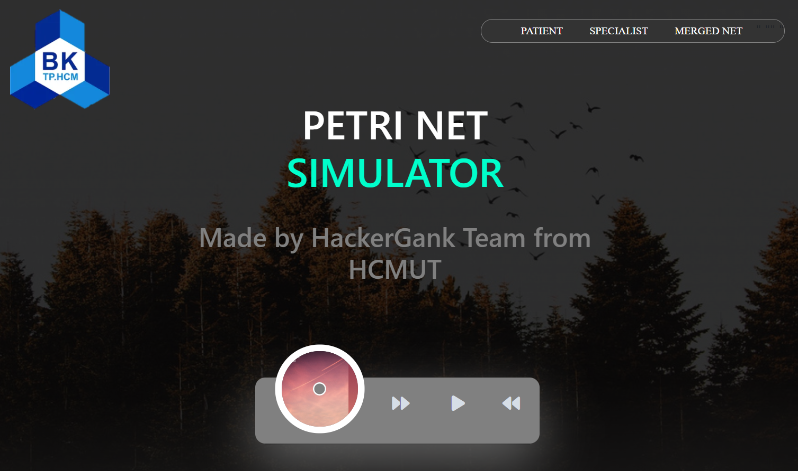
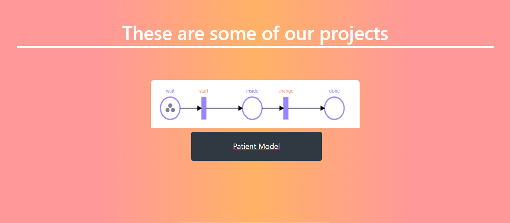
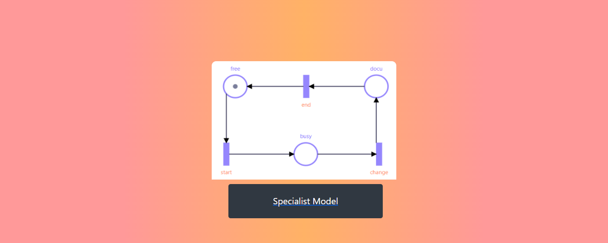
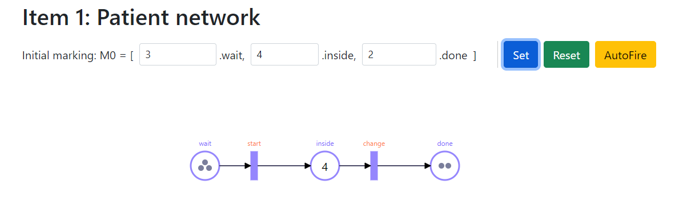
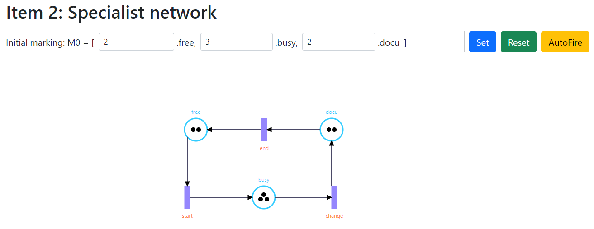
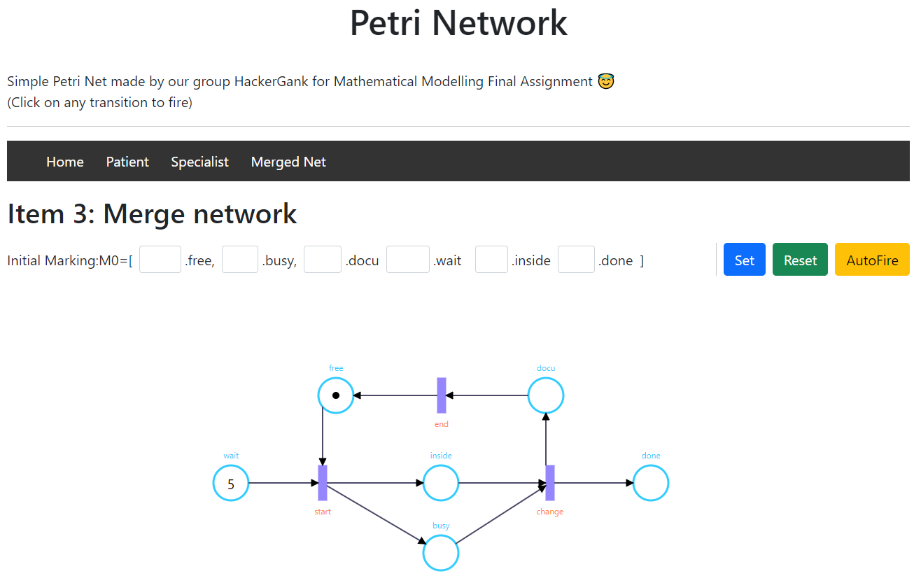

# Petri Net Simulator Package 
This is a calculation package write in C++ for answering problem in Math Modeling Problem 
## Running Program
The source Code contain files "main.cpp" "PetriNet.h", you can build with compiler or just run the main.exe
## Manual

At first sight, you will see 4 option:
1. Patient
2. Specialist
3. Merge
4. Optional
    - With option 1,2 and 3 the Petri Net is constructed similar to that the assignment demanded.
    - The option 4 is for constructing a custom Petri Net.

The input file is '.txt' and has to be stored in the same directory with main.exe
Here the Input Form:

- After Choosing Option you will be asked to enter the Initial Marking.

**Note that:** The input must be numberic and non-negative

- The Petri Net will be initialize and go on we will have some feature

1. The program prints the state of the current Place nodes and Transitionnodes. Then, it will fire the Transition nodes based on the input and print the state of Place andTransition in succession. Regarding the input, each transition should be separated by whitespaceand a period to signify the end of the input. Example: With the Patient’s Petri Net the inputshould be “start start change .” (whitespace before the period at the end is necessary) In case thetransition names entered are not in the Petri Net, the program will ignore those transitions andrun the remaining ones. Example: As the input “start abc start def change .” is entered, transition“abc” and “def” are ignored as they are not initialized yet. Therefore, the firing sequence is now“start start change .”
2. The program prints the set of reachable markings from the current marking.
3. The program prints the current state of all Place nodes.
4. The program prints the current state of all Transition nodes.
5. The program prints the current Place nodes and Transition nodes. Thenthe user enters which input to fire. The program then prints the state of the Place and Transitionnodes after the firing.
6. The program reinitializes the Petri Net to the initial marking.
7. Then the user must first set a limit on the number of tokens in a place,then the programs will proceed to create a transition system based on the input. If the operationtime of the function does not exceed a certain limit then a transition system will be printed inthe form of an adjacency list
8. If the option is “clear“ or “cls” or “Clear” or “CLEAR”, the program clears the screen.
9. 
Otherwise, their will be Invalid Choice and the program will asked you to enter again.

After that, You will be asked to be continued or not. 

# Petri Net Visualizing 
## Motivation
Due to the graphical constraints of the programming language C++,
our group decides to move to JavaScript to visualize the Petri Net that we propose in the assignment.
Despite the changes in programming language, the core idea for the Petri Net is still the same.
Visualization of the Petri Net helps the viewers have an overarching view of the whole process.
Furthermore, concurrency is better viewed in graph form of the Petri Net.
## Librabry and Dependency 
In this project we used some libraries and frameworks to construct the web structure: **Bootstrap** for designing the web UI and **Jointjs** for visualizing the Petri Net model. In addition, we also include some other related libraries. All of which have been shown at the header of the webpage.

## First View
First of all we wil come to Home Page, you can run index.html in Visualize Folder or just simply visit [Petri Network Simulator](02david20.github.io) for further update

In the top right corner of the page, there is a navigation bar with three options which rep-resents the three Petri Net that our group proposed in the report, which are the Patient PetriNet, Specialist Petri Net and Merged Petri Net.

Below, we have previews for the Petri Nets:

- **Patient Model:**

- **Specialist Model:**

- **Merge Model:**

Going into separate models, we first go into file Patient.html, either through the links inthe website or the file named Patient.html in the folder:

### Patient Model

   At the top, the navigation bar now has an additional button, “Home”, which allows the user toreturn to the home page when clicked, the other buttons still lead to their corresponding models.
   
   For the Petri Net representing the process of patients being treated below, to best simulate,first the initial marking needs to be filled. To update the Petri Net, the user will have to pressthe button “Set” after they have filled out all the input slots.
   
   Setting an initial marking:
   
   After the Petri Net has been set, there are two ways in which the user can simulate theprocess of firing, either by pressing individual transitions or through the “AutoFire” button
- By pressing a transition, if all the conditions are satisfied for it to be enabled, a firingprocess of that transition will happen. This operation mainly involved consuming a tokenin all of its input places, and generating a token in all of its output places. This is simulatedthrough an animation of a token going from the input places, through the transition, andthen going to the output places. The animation takes some time to finish, so it is advisableto refrain from pressing a transition in quick succession (an error may occur)
- By pressing the “AutoFire” button, any transitions which are enabled will be fired at once.This process will repeat itself until the Petri Net reaches a terminal marking (a markingwhich has no enabled transition). This feature is best used to view concurrency in the PetriNet. Here is an example of the Petri Net autofiring
- After the user has finished viewing and interacting with the Petri Net, there is a “Reset”button to revert the Petri Net back to its original state

Same execution will be running with the Specialist Model and Merge Model
## Specialist Model

## Merge Model

## Contribution
The web is build with the attemp of our team, deal to time constraint, the webpage maybe not having enough feature but we will update in near future. Please visit our webpage at 
[Petri Network Simulator](02david20.github.io) for our futher update
